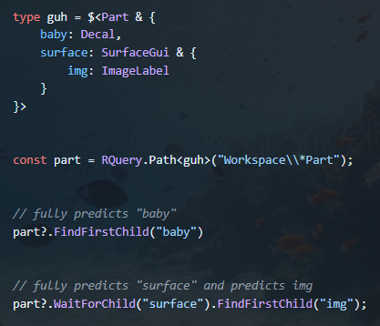

---

<a
    href="https://www.npmjs.com/package/rbxts-rquery">
    
</a>

<a 
    href="https://www.npmjs.com/package/rbxts-rquery">
    
</a>
<a 
    href="https://www.npmjs.com/package/rbxts-rquery">
    
</a>
<a href="https://www.npmjs.com/package/roblox-ts">
    
</a>
<a 
    href="https://github.com/shysolocup/rbxts-rquery/wiki">
    
</a>


<br>


⚠️ __PLEASE NOTE:__
this package is currently in active development and is far from finished ⚠️ 

<br>

A small feature-rich Roblox-TS package for more helpful types and simpler management of instances, properties, and attributes.

Obviously inspired in some part by [jQuery](https://jquery.com/).

It includes an RQuery namespace for instance creation and management as well as a ton of method overrides under the `$<BaseType>` type.

It's this simple

```console
npm i rbxts-rquery
```



RQuery combines the already existent methods of [indexing children in Roblox-TS](https://roblox-ts.com/docs/guides/indexing-children) and combines it with type overwrites to get better type prediction and autofill.

it's also <u>*NON-STRICT*</u> meaning you can still use it COMPLETELY normally without any RQuery stuff.

<br>

---

### Better Children Indexing
RQueries override default Roblox-TS instance functions with better typed ones allowing for more type predictions and autofill.

This doesn't change anything but how you write.

```ts
type guh = $<Part & {
    baby: Decal,
    surface: SurfaceGui & {
        img: ImageLabel
    }
}>


const part = RQuery.Path<guh>("Workspace\\*Part");


// fully predicts "baby"
part?.FindFirstChild("baby")


// fully predicts "surface" and predicts img
part?.WaitForChild("surface").FindFirstChild("img");
```

<br>

---

### Instance Management
RQuery has a few tools for improving instance management in projects.

First: `RQuery.Path` which lets you path to an instance through an extremely feature rich system including:
- shorthand names (`Shared\\`, `Server\\`, `Client\\`, `LocalPlayer\\`, `Character\\`, `Gui\\`)
- unique names (`@name`)
- yields (`*name`)
- unique name yields (`*@name`)
- relative (2nd argument)

```ts
RQuery.Path("Workspace\\Baseplate\\Texture");
RQuery.Path("@Baseplate");
RQuery.Path("Workspace\\*Baseplate\\*Texture");
RQuery.Path("*Baseplate\\*Texture", Workspace);
RQuery.Path("*@Baseplate\\*Texture");
```

Second: `RQuery.Instantiate` which lets you create instances with complex properties, children, and attributes on the fly.

(also `RQuery.Propertize`)

```ts
// full type predictions for instance names, properties, children, and attributes

const part = RQuery.Instantiate("Part", {
    "Parent": Workspace,

    "Size": new Vector3(1, 1, 1),
    "Transparency": 1,

    "Attributes": {
        guh: 1,
        AGHH: "buh"
    },

    "Children": [
        RQuery.Instantiate("Decal", {
            "Name": "baby",
            "Texture": "rbxassetid://8088027399"
        })
    ]
})
```

Lastly: `RQuery.New` which lets you create from a class and automatically give it properties

this is mostly useful for things like params (RaycastParams, OverlapParams)

```ts
// also fully type predicted

const params = RQuery.New(RaycastParams, {
    RespectCanCollide: true,
    CollisionGroup: "PlayerPass"
})
```

<br>

---


## Collaborators

<table>
    
  <tr>
    <td align="center">
        <a href="https://github.com/shysolocup">
                
                <br/>
                <sub><b>shysolocup</b></sub>
            </a>
        <br/>
    </td>
</tr>
    
      
</table>

<br>

---

<br>

## Disclaimer
this package and the developers behind it are not associated with Roblox, Roblox-TS, or jQuery

<br><br>